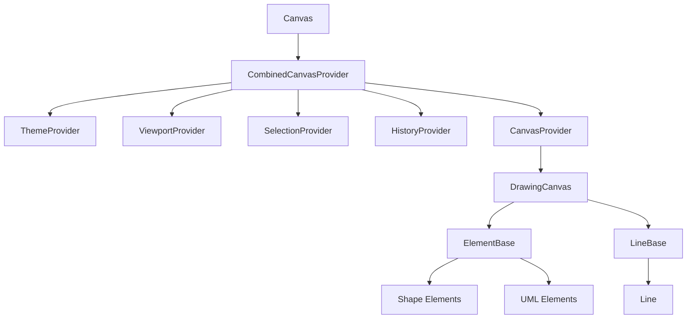

# @jrodrigopuca/canvas

A React component library for creating interactive SVG-based diagrams, shapes, and drawing applications.

[](https://www.npmjs.com/package/@jrodrigopuca/canvas)
[](https://www.typescriptlang.org/)
[](https://reactjs.org/)

## Features

- 🎨 **SVG-based rendering** - Scalable, accessible, and easy to export
- 🧩 **Composable components** - Use individual elements or the full canvas
- 🎯 **Interactive** - Drag, resize, select, and connect elements
- ⌨️ **Keyboard shortcuts** - Undo/redo, copy/paste, delete, zoom
- 🎭 **Theming** - Light/dark themes with full customization
- 📐 **Grid & Snap** - Align elements precisely
- 🔄 **Undo/Redo** - Full history support
- 📦 **Zero runtime dependencies** - Only React as peer dependency
- 💪 **TypeScript first** - Full type definitions included

## Installation

```bash
npm install @jrodrigopuca/canvas
# or
yarn add @jrodrigopuca/canvas
# or
pnpm add @jrodrigopuca/canvas
```

## Quick Start

```tsx
import { Canvas } from "@jrodrigopuca/canvas";

function App() {
	return (
		<Canvas
			width={800}
			height={600}
			theme="light"
			defaultElements={[
				{
					id: "1",
					type: "rectangle",
					x: 100,
					y: 100,
					width: 120,
					height: 80,
					zIndex: 0,
				},
			]}
			onChange={(elements, connections) => {
				console.log("Canvas updated:", elements);
			}}
		/>
	);
}
```

## Available Elements

### Shapes

| Element   | Type        | Description                                     |
| --------- | ----------- | ----------------------------------------------- |
| Rectangle | `rectangle` | Basic rectangle with optional rounded corners   |
| Ellipse   | `ellipse`   | Ellipse/oval shape                              |
| Circle    | `circle`    | Perfect circle (ellipse with equal dimensions)  |
| Diamond   | `diamond`   | Rhombus/diamond shape                           |
| Text      | `text`      | Text with inline editing (double-click to edit) |
| Line      | `line`      | Line with endpoint handles, solid/dashed/dotted |

### UML Elements

| Element       | Type            | Description                                             |
| ------------- | --------------- | ------------------------------------------------------- |
| Actor         | `actor`         | Stick figure with editable label (double-click to edit) |
| Lifeline      | `lifeline`      | Participant with editable label (double-click to edit)  |
| Message       | `message`       | Arrow with editable label (sync/async/return)           |
| ActivationBar | `activationBar` | Execution occurrence on lifeline                        |

## Architecture



## Documentation

- [API Reference](./docs/API.md) - Complete API documentation
- [Components](./docs/COMPONENTS.md) - Component documentation
- [Examples](./docs/EXAMPLES.md) - Usage examples

## Usage Modes

### Uncontrolled Mode (Simple)

```tsx
<Canvas
	defaultElements={initialElements}
	onChange={(elements) => saveToServer(elements)}
/>
```

### Controlled Mode (Full control)

```tsx
const [elements, setElements] = useState(initialElements);

<Canvas
	elements={elements}
	onChange={(newElements) => setElements(newElements)}
/>;
```

## Imperative API

Access canvas methods via ref:

```tsx
const canvasRef = useRef<CanvasRef>(null);

// Add element programmatically
canvasRef.current?.addElement({
	type: "rectangle",
	x: 200,
	y: 150,
	width: 100,
	height: 60,
	zIndex: 1,
});

// Undo/redo
canvasRef.current?.undo();
canvasRef.current?.redo();

// Export
const json = canvasRef.current?.toJSON();
const svg = canvasRef.current?.toSVG();

// Export to image (PNG/JPEG)
const pngBlob = await canvasRef.current?.toImage({ format: "png" });
const jpegBlob = await canvasRef.current?.toImage({
	format: "jpeg",
	quality: 0.9,
});

// Import from JSON
canvasRef.current?.fromJSON(jsonString);

<Canvas ref={canvasRef} />;
```

## Theming

### Built-in Themes

```tsx
<Canvas theme="light" />
<Canvas theme="dark" />
```

### Custom Theme

```tsx
import { Canvas, Theme } from "@jrodrigopuca/canvas";

const customTheme: Theme = {
	name: "custom",
	colors: {
		background: "#1a1a2e",
		surface: "#16213e",
		// ... see Theme type for full definition
	},
	// ...
};

<Canvas theme={customTheme} />;
```

## Keyboard Shortcuts

| Shortcut               | Action          |
| ---------------------- | --------------- |
| `Ctrl/Cmd + Z`         | Undo            |
| `Ctrl/Cmd + Shift + Z` | Redo            |
| `Ctrl/Cmd + A`         | Select all      |
| `Ctrl/Cmd + C`         | Copy            |
| `Ctrl/Cmd + V`         | Paste           |
| `Ctrl/Cmd + X`         | Cut             |
| `Delete/Backspace`     | Delete selected |
| `Escape`               | Clear selection |
| `Ctrl/Cmd + +`         | Zoom in         |
| `Ctrl/Cmd + -`         | Zoom out        |
| `Ctrl/Cmd + 0`         | Reset zoom      |

## Using Individual Elements

Elements can be used independently outside the Canvas:

```tsx
import { Rectangle, withElementBehavior } from "@jrodrigopuca/canvas";

// Create custom element
const MyCustomShape = withElementBehavior(({ element }) => (
	<polygon
		points="50,0 100,50 50,100 0,50"
		fill={element.style?.fill ?? "#3b82f6"}
	/>
));
```

## Factory Functions

Create elements with proper defaults:

```tsx
import { createRectangle, createActor } from "@jrodrigopuca/canvas";

const rect = createRectangle({ x: 100, y: 100, width: 80, height: 60 });
const actor = createActor({ x: 200, y: 100, label: "User" });
```

## Browser Support

- Chrome (latest)
- Firefox (latest)
- Safari (latest)
- Edge (latest)

## Contributing

Contributions are welcome! Please read our contributing guidelines before submitting a PR.

## License

MIT © [jrodrigopuca](https://github.com/jrodrigopuca)
