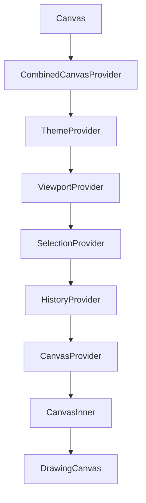
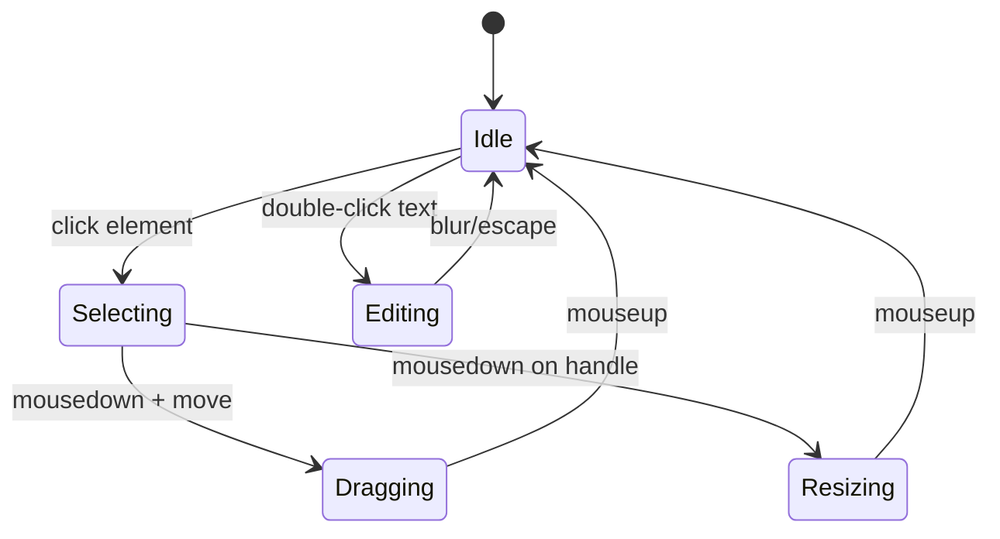

# Component Documentation

Detailed documentation for all components in `@jrodrigopuca/canvas`.

## Table of Contents

- [Canvas](#canvas)
- [DrawingCanvas](#drawingcanvas)
- [Shape Elements](#shape-elements)
  - [Rectangle](#rectangle)
  - [Ellipse](#ellipse)
  - [Diamond](#diamond)
  - [TextElement](#textelement)
  - [Line](#line)
- [UML Elements](#uml-elements)
  - [Actor](#actor)
  - [Lifeline](#lifeline)
  - [Message](#message)
  - [ActivationBar](#activationbar)
- [Base Components](#base-components)
  - [ElementBase](#elementbase)
  - [withElementBehavior](#withelementbehavior)

---

## Canvas

The main canvas component that provides a complete drawing environment.

### Type

**Composite Component** - Combines providers, state management, and rendering.

### Architecture



### Props

| Prop                      | Type                         | Default   | Required | Description                     |
| ------------------------- | ---------------------------- | --------- | -------- | ------------------------------- |
| `elements`                | `CanvasElement[]`            | -         | No       | Controlled mode elements        |
| `connections`             | `Connection[]`               | -         | No       | Controlled mode connections     |
| `defaultElements`         | `CanvasElement[]`            | `[]`      | No       | Initial elements (uncontrolled) |
| `width`                   | `number`                     | `800`     | No       | Canvas width                    |
| `height`                  | `number`                     | `600`     | No       | Canvas height                   |
| `theme`                   | `'light' \| 'dark' \| Theme` | `'light'` | No       | Theme configuration             |
| `readonly`                | `boolean`                    | `false`   | No       | Disable interactions            |
| `showGrid`                | `boolean`                    | `false`   | No       | Show grid                       |
| `gridSize`                | `number`                     | `20`      | No       | Grid cell size                  |
| `enableKeyboardShortcuts` | `boolean`                    | `true`    | No       | Enable shortcuts                |
| `onChange`                | `Function`                   | -         | No       | Change callback                 |
| `onSelectionChange`       | `Function`                   | -         | No       | Selection callback              |

### State Flow



### Dependencies

| Dependency         | Purpose                     | Required |
| ------------------ | --------------------------- | -------- |
| `ThemeContext`     | Provides colors and styling | Yes      |
| `ViewportContext`  | Zoom and pan state          | Yes      |
| `SelectionContext` | Selected elements           | Yes      |
| `HistoryContext`   | Undo/redo state             | Yes      |
| `CanvasContext`    | Element state               | Yes      |

### Example

```tsx
import { Canvas, CanvasRef } from "@jrodrigopuca/canvas";
import { useRef } from "react";

function App() {
	const canvasRef = useRef<CanvasRef>(null);

	return (
		<Canvas
			ref={canvasRef}
			width={1000}
			height={700}
			theme="dark"
			showGrid
			gridSize={25}
			defaultElements={[
				{
					id: "1",
					type: "rectangle",
					x: 50,
					y: 50,
					width: 100,
					height: 80,
					zIndex: 0,
				},
			]}
			onChange={(elements) => console.log("Changed:", elements)}
		/>
	);
}
```

---

## DrawingCanvas

SVG container that renders all canvas elements.

### Type

**Container Component** - Manages element rendering and viewport transformations.

### Props

| Prop            | Type            | Default     | Description              |
| --------------- | --------------- | ----------- | ------------------------ |
| `width`         | `number`        | from config | SVG width                |
| `height`        | `number`        | from config | SVG height               |
| `showGrid`      | `boolean`       | `false`     | Show grid pattern        |
| `gridSize`      | `number`        | `20`        | Grid cell size           |
| `className`     | `string`        | -           | CSS class                |
| `style`         | `CSSProperties` | -           | Inline styles            |
| `onCanvasClick` | `Function`      | -           | Background click handler |
| `children`      | `ReactNode`     | -           | Custom overlays          |

### SVG Structure

```xml
<svg viewBox="0 0 {width} {height}">
  <g transform="translate({pan.x}, {pan.y}) scale({zoom})">
    <!-- Grid pattern -->
    <defs>
      <pattern id="grid">...</pattern>
    </defs>
    <rect fill="url(#grid)" />

    <!-- Elements sorted by z-index -->
    <g>{elements.map(renderElement)}</g>

    <!-- Custom children (overlays) -->
    {children}
  </g>
</svg>
```

### Example

```tsx
import { DrawingCanvas, CanvasProvider } from "@jrodrigopuca/canvas";

function CustomCanvas() {
	return (
		<CanvasProvider initialElements={[]}>
			<DrawingCanvas
				width={800}
				height={600}
				showGrid
				onCanvasClick={() => console.log("Background clicked")}
			/>
		</CanvasProvider>
	);
}
```

---

## Shape Elements

### Rectangle

Basic rectangle shape with optional rounded corners.

#### SVG Output

```xml
<g transform="translate({x}, {y})">
  <rect
    width="{width}"
    height="{height}"
    fill="{fill}"
    stroke="{stroke}"
    stroke-width="{strokeWidth}"
    rx="{cornerRadius}"
    ry="{cornerRadius}"
  />
</g>
```

#### Props

Inherits from `WithElementBehaviorProps`:

| Prop          | Type            | Description          |
| ------------- | --------------- | -------------------- |
| `element`     | `CanvasElement` | Element data         |
| `disabled`    | `boolean`       | Disable interactions |
| `showHandles` | `boolean`       | Show resize handles  |
| `onSelect`    | `Function`      | Selection callback   |
| `onDrag`      | `Function`      | Drag callback        |
| `onResize`    | `Function`      | Resize callback      |

#### Element Properties

| Property             | Type     | Default       | Description   |
| -------------------- | -------- | ------------- | ------------- |
| `style.fill`         | `string` | theme default | Fill color    |
| `style.stroke`       | `string` | theme default | Stroke color  |
| `style.strokeWidth`  | `number` | `2`           | Border width  |
| `style.cornerRadius` | `number` | `0`           | Corner radius |
| `style.opacity`      | `number` | `1`           | Opacity (0-1) |

#### Example

```tsx
<Rectangle
	element={{
		id: "1",
		type: "rectangle",
		x: 100,
		y: 100,
		width: 150,
		height: 100,
		zIndex: 0,
		style: {
			fill: "#3b82f6",
			stroke: "#1d4ed8",
			strokeWidth: 2,
			cornerRadius: 8,
		},
	}}
/>
```

---

### Ellipse

Ellipse/oval shape. Also exported as `Circle` and `Oval` aliases.

#### SVG Output

```xml
<g transform="translate({x}, {y})">
  <ellipse
    cx="{width/2}"
    cy="{height/2}"
    rx="{width/2}"
    ry="{height/2}"
    fill="{fill}"
    stroke="{stroke}"
  />
</g>
```

#### Element Properties

| Property            | Type     | Default       | Description  |
| ------------------- | -------- | ------------- | ------------ |
| `style.fill`        | `string` | theme default | Fill color   |
| `style.stroke`      | `string` | theme default | Stroke color |
| `style.strokeWidth` | `number` | `2`           | Border width |

#### Example

```tsx
// Ellipse
<Ellipse
  element={{
    id: '2',
    type: 'ellipse',
    x: 200,
    y: 150,
    width: 120,
    height: 80,
    zIndex: 0,
  }}
/>

// Circle (use equal width/height)
<Circle
  element={{
    id: '3',
    type: 'circle',
    x: 300,
    y: 200,
    width: 80,
    height: 80,
    zIndex: 0,
  }}
/>
```

---

### Diamond

Rhombus/diamond shape for decision nodes.

#### SVG Output

```xml
<g transform="translate({x}, {y})">
  <polygon
    points="{centerX},0 {width},{centerY} {centerX},{height} 0,{centerY}"
    fill="{fill}"
    stroke="{stroke}"
  />
</g>
```

#### Example

```tsx
<Diamond
	element={{
		id: "4",
		type: "diamond",
		x: 250,
		y: 180,
		width: 100,
		height: 100,
		zIndex: 0,
		style: { fill: "#fbbf24", stroke: "#d97706" },
	}}
/>
```

---

### TextElement

Editable text element with font customization.

#### SVG Output

```xml
<g transform="translate({x}, {y})">
  <text
    font-size="{fontSize}"
    font-family="{fontFamily}"
    font-weight="{fontWeight}"
    text-anchor="{textAnchor}"
    fill="{fill}"
  >
    {text}
  </text>
</g>
```

#### Element Properties

| Property     | Type                            | Default        | Description         |
| ------------ | ------------------------------- | -------------- | ------------------- |
| `text`       | `string`                        | `''`           | Text content        |
| `fontSize`   | `number`                        | `14`           | Font size in pixels |
| `fontFamily` | `string`                        | `'sans-serif'` | Font family         |
| `fontWeight` | `'normal' \| 'bold'`            | `'normal'`     | Font weight         |
| `textAlign`  | `'left' \| 'center' \| 'right'` | `'left'`       | Text alignment      |

#### Example

```tsx
<TextElement
	element={{
		id: "5",
		type: "text",
		x: 100,
		y: 50,
		width: 200,
		height: 30,
		zIndex: 1,
		text: "Hello World",
		fontSize: 18,
		fontWeight: "bold",
		textAlign: "center",
	}}
/>
```

---

### Line

Line with multiple points and line styles.

#### SVG Output

```xml
<g transform="translate({x}, {y})">
  <!-- Invisible wider path for selection -->
  <path d="{pathData}" stroke="transparent" stroke-width="10" />

  <!-- Visible line -->
  <path
    d="{pathData}"
    stroke="{stroke}"
    stroke-width="{strokeWidth}"
    stroke-dasharray="{dasharray}"
    stroke-linecap="round"
  />
</g>
```

#### Element Properties

| Property   | Type                              | Default   | Description |
| ---------- | --------------------------------- | --------- | ----------- |
| `points`   | `Point[]`                         | diagonal  | Line points |
| `lineType` | `'solid' \| 'dashed' \| 'dotted'` | `'solid'` | Line style  |

#### Example

```tsx
<Line
	element={{
		id: "6",
		type: "line",
		x: 0,
		y: 0,
		width: 200,
		height: 100,
		zIndex: 0,
		points: [
			{ x: 50, y: 50 },
			{ x: 150, y: 100 },
			{ x: 250, y: 50 },
		],
		lineType: "dashed",
	}}
/>
```

---

## UML Elements

### Actor

Stick figure for use case diagrams.

#### SVG Output

```xml
<g transform="translate({x}, {y})">
  <!-- Background for selection -->
  <rect width="{width}" height="{height}" fill="transparent" />

  <!-- Head -->
  <circle cx="{centerX}" cy="{headRadius}" r="{headRadius}" />

  <!-- Body -->
  <line x1="{centerX}" y1="{bodyTop}" x2="{centerX}" y2="{bodyBottom}" />

  <!-- Arms -->
  <line x1="{leftArm}" y1="{armY}" x2="{rightArm}" y2="{armY}" />

  <!-- Legs -->
  <line x1="{centerX}" y1="{bodyBottom}" x2="{leftLeg}" y2="{legBottom}" />
  <line x1="{centerX}" y1="{bodyBottom}" x2="{rightLeg}" y2="{legBottom}" />

  <!-- Label -->
  <text y="{labelY}" text-anchor="middle">{label}</text>
</g>
```

#### Element Properties

| Property | Type     | Default | Description |
| -------- | -------- | ------- | ----------- |
| `label`  | `string` | `''`    | Actor name  |

#### Example

```tsx
<Actor
	element={{
		id: "actor1",
		type: "actor",
		x: 50,
		y: 100,
		width: 60,
		height: 100,
		zIndex: 0,
		label: "User",
	}}
/>
```

---

### Lifeline

Participant in sequence diagrams.

#### SVG Output

```xml
<g transform="translate({x}, {y})">
  <!-- Header box -->
  <rect width="{width}" height="{headerHeight}" />

  <!-- Label -->
  <text>{label}</text>

  <!-- Dashed lifeline -->
  <line
    x1="{centerX}" y1="{headerHeight}"
    x2="{centerX}" y2="{height}"
    stroke-dasharray="5 5"
  />
</g>
```

#### Element Properties

| Property | Type     | Default | Description      |
| -------- | -------- | ------- | ---------------- |
| `label`  | `string` | `''`    | Participant name |

#### Example

```tsx
<Lifeline
	element={{
		id: "lifeline1",
		type: "lifeline",
		x: 100,
		y: 50,
		width: 100,
		height: 400,
		zIndex: 0,
		label: "Client",
	}}
/>
```

---

### Message

Arrow between lifelines for sequence diagrams.

#### SVG Output

```xml
<g transform="translate({x}, {y})">
  <!-- Line -->
  <path d="M 0 {centerY} L {width} {centerY}" />

  <!-- Arrowhead -->
  <polygon points="{arrowPoints}" />

  <!-- Label -->
  <text>{label}</text>
</g>
```

#### Element Properties

| Property      | Type                                        | Default  | Description        |
| ------------- | ------------------------------------------- | -------- | ------------------ |
| `label`       | `string`                                    | `''`     | Message text       |
| `messageType` | `'sync' \| 'async' \| 'return' \| 'create'` | `'sync'` | Arrow style        |
| `fromId`      | `string`                                    | -        | Source lifeline ID |
| `toId`        | `string`                                    | -        | Target lifeline ID |

#### Message Types

| Type     | Visual                        |
| -------- | ----------------------------- |
| `sync`   | Solid line, filled arrowhead  |
| `async`  | Solid line, open arrowhead    |
| `return` | Dashed line, open arrowhead   |
| `create` | Dashed line, filled arrowhead |

#### Example

```tsx
<Message
	element={{
		id: "msg1",
		type: "message",
		x: 150,
		y: 150,
		width: 150,
		height: 30,
		zIndex: 1,
		label: "request()",
		messageType: "sync",
	}}
/>
```

---

### ActivationBar

Execution occurrence on a lifeline.

#### SVG Output

```xml
<g transform="translate({x}, {y})">
  <rect
    width="{width}"
    height="{height}"
    fill="{fill}"
    stroke="{stroke}"
  />
</g>
```

#### Example

```tsx
<ActivationBar
	element={{
		id: "activation1",
		type: "activationBar",
		x: 135,
		y: 170,
		width: 10,
		height: 80,
		zIndex: 2,
		style: { fill: "#e5e7eb", stroke: "#9ca3af" },
	}}
/>
```

---

## Base Components

### ElementBase

Base wrapper component for all canvas elements.

#### Purpose

- Handles selection state
- Provides drag functionality
- Provides resize handles
- Applies transforms (position, rotation)

#### Props

| Prop            | Type            | Required | Description           |
| --------------- | --------------- | -------- | --------------------- |
| `element`       | `CanvasElement` | Yes      | Element data          |
| `children`      | `ReactNode`     | Yes      | Element content       |
| `disabled`      | `boolean`       | No       | Disable interactions  |
| `showHandles`   | `boolean`       | No       | Show resize handles   |
| `onSelect`      | `Function`      | No       | Selection callback    |
| `onDragStart`   | `Function`      | No       | Drag start callback   |
| `onDrag`        | `Function`      | No       | Drag callback         |
| `onDragEnd`     | `Function`      | No       | Drag end callback     |
| `onResizeStart` | `Function`      | No       | Resize start callback |
| `onResize`      | `Function`      | No       | Resize callback       |
| `onResizeEnd`   | `Function`      | No       | Resize end callback   |

---

### withElementBehavior

Higher-Order Component that wraps a render function with element behavior.

#### Signature

```typescript
function withElementBehavior<P extends ElementRenderProps>(
	RenderComponent: ComponentType<P>,
): ForwardRefExoticComponent<
	WithElementBehaviorProps & RefAttributes<SVGGElement>
>;
```

#### Usage

```tsx
import { withElementBehavior, ElementRenderProps } from "@jrodrigopuca/canvas";

interface MyShapeProps extends ElementRenderProps {}

const MyShapeRender: React.FC<MyShapeProps> = ({ element }) => (
	<polygon
		points="50,0 100,50 50,100 0,50"
		fill={element.style?.fill ?? "#3b82f6"}
		stroke={element.style?.stroke ?? "#1d4ed8"}
	/>
);

export const MyShape = withElementBehavior(MyShapeRender);
```

#### Props Received by Render Component

| Prop         | Type            | Description     |
| ------------ | --------------- | --------------- |
| `element`    | `CanvasElement` | Element data    |
| `isSelected` | `boolean`       | Selection state |
| `isDragging` | `boolean`       | Dragging state  |
| `isResizing` | `boolean`       | Resizing state  |

---

## Known Issues

| Issue                                        | Severity  | Workaround          | Status       |
| -------------------------------------------- | --------- | ------------------- | ------------ |
| Text editing on double-click not implemented | 🟡 Medium | Use controlled mode | Planned      |
| Connection auto-routing not implemented      | 🟢 Low    | Manual positioning  | Planned v0.2 |
| Touch events not fully supported             | 🟡 Medium | Use mouse events    | In Progress  |

---

## Best Practices

1. **Use factory functions** for creating elements to ensure proper defaults
2. **Prefer controlled mode** for complex applications with external state
3. **Memoize callbacks** passed to Canvas to prevent unnecessary re-renders
4. **Use ref methods** for imperative operations like undo/redo
5. **Wrap custom elements** with `withElementBehavior` for consistent behavior
